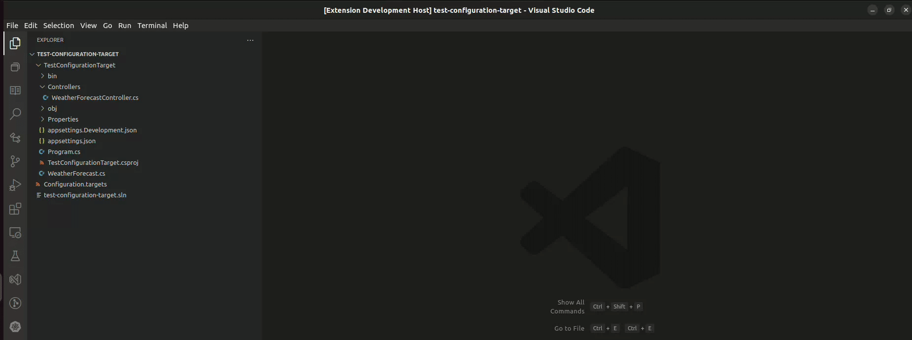

# Customized version of <https://github.com/jchannon/csharpextensions> -> <https://github.com/KreativJos/csharpextensions> -> <https://github.com/bard83/csharpextensions>

# C# Extensions

Welcome to C# Extensions.  This VSCode extension provides extensions to the IDE that will hopefully speed up your development workflow.
It can currently be found at:

- [VS Code Marketplace](https://marketplace.visualstudio.com/items?itemName=bard83.csharpextension)
- Open VSX (not yet published)

## Features

**Add C# Class**


**Add C# Enum**


**Add C# Interface**


**Add constructor from properties**


**Add body expression constructor from properties**


This extension traverses up the folder tree to find the project.json or *.csproj and uses that as the parent folder to determine namespaces.

### Custom Templates

#### Definition

The custom template must be defined in the vscode `settings.json` file. Access to File->Preference->Settings, Explode the Extensions section and select C# Extension then click on `edit in settings.json` .In the new section `csharpextensions.templates` must define the list of `items` which contain the custom templates. An item template is defined like below:

```json
{
    "name": "MyCustomTemplate",
    "visibility": "public",
    "construct": "class",
    "description": "My awesome c# template",
    "header": "using System;\nusing System.Runtime.Serialization;\nusing System.Text.Json;",
    "declaration": "ISerializable, IEquatable",
    "body": "public void MyFancyMethod(string variable)\n{\n    System.Console.WriteLine(\"Hello World\");\n}"
}
```

`visibility` C# component visibility (public, private and etc...);

`construct` actually supported `class`, `interface` and `struct`;

`header` is used to group all the necessary usings module. Each using must be separated by a `;`. The keyword `using` or the new line `\n` can be omitted. "using System;\nusing System.Runtime.Serialization;\nusing System.Text.Json;" and "System;System.Runtime.Serialization;System.Text.Json" produce the same output. Implicit usings rules will be applied.

`declaration` used to append all the necessary extended or implemented class or interface. The colon before the declaration will be automatically added. It could be used to add also generic clauses.

`body` body of template. It might be whatever C# code.

Please note that the code defined inside the custom template should be valid C# code. This extension does not perform any validation on it.

**Add new custom template**



-----------------------------------------------------------------------------------------------------------

## Licence

MIT

See [licence.txt](./licence.txt)
Legacy Repository: [jchannon/csharpextensions](https://github.com/jchannon/csharpextensions)
